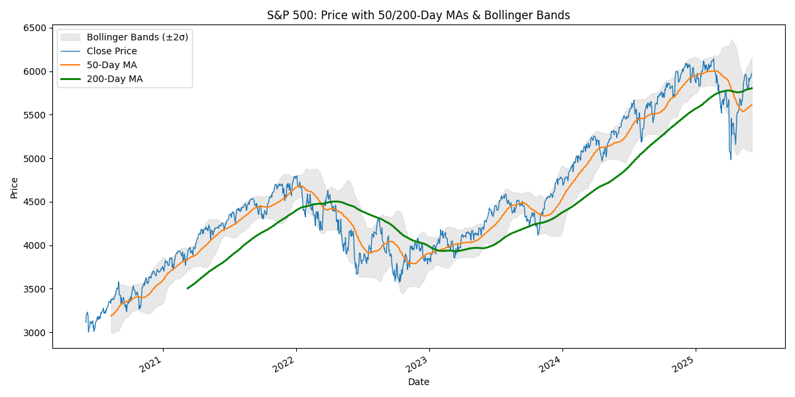
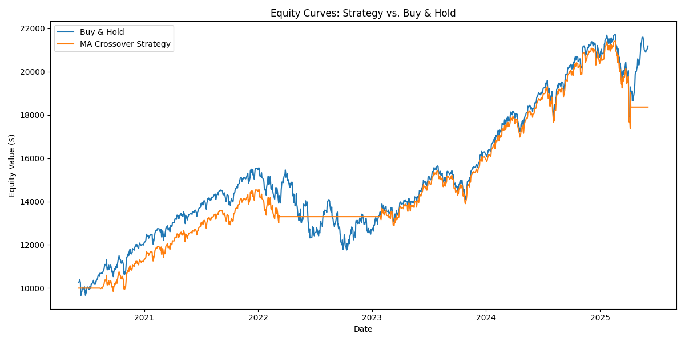
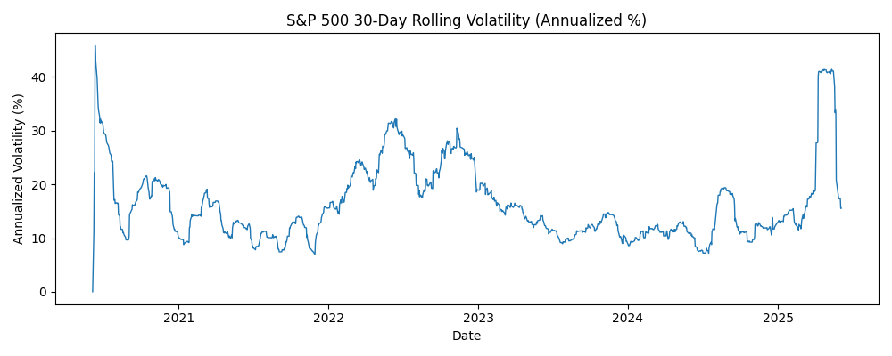

# SP500-Analytics Project
## Overview
This end-to-end analytics project ingests five years of daily S&P 500 closing prices into a relational database, builds a suite of SQL views for core time-series computations, and then uses Python (pandas + Matplotlib) to visualize insights, test a simple moving-average crossover strategy, and compare it against buy-and-hold.

- Data Source: Daily closing levels from FRED (S&P 500). https://fred.stlouisfed.org/series/SP500
  - Data used for this porject ranges from 6/6/20 to 6/6/25
- Data Structure
  - closePrice
  - observation_date
- Database: MySQL, with window functions and CTEs for time-series metrics.
- Analysis & Visualization: Python (pandas, Matplotlib, mysql-connector-python)

## Key Visualizations

### Moving Averages & Bollinger Bands  

- Blue line: daily S&P 500 close price
- Orange line: average of the last 50 days (short-term trend)
- Green line: average of the last 200 days (long-term trend)
- Gray shaded area: two standard deviation bands around the 50-day average. When bands widen, the markey is more volatile; when they narrow, it's clamer.

### Equity Curve Comparison  

Starting from $10 000 on the first trading day, the blue line shows a pure buy-and-hold investment in the S&P 500, while the orange line shows the same capital deployed only when the 50-day MA is above the 200-day MA. Comparing the two curves illustrates how the moving-average crossover can reduce drawdowns during downturns—albeit sometimes underperforming in strong bull markets—by shifting to cash when the short-term trend reverses.

### 30-Day Rolling Volatility

- This line shows how "wild" daily returns have been, measured over the past 30 trading days and scaled to a yearly rate.
- High spikes indicates bug daily swings and stress.
- Low valleys means the market has been relatively calm.
